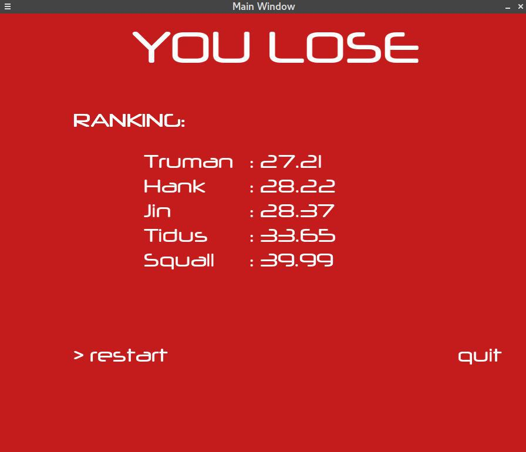
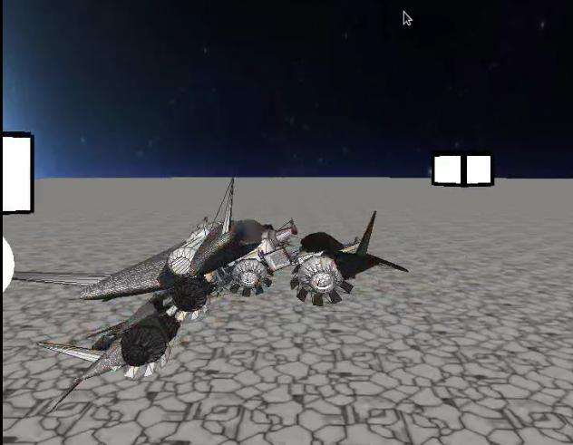
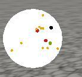
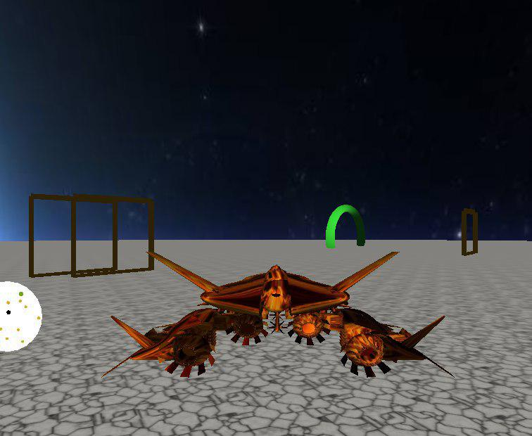
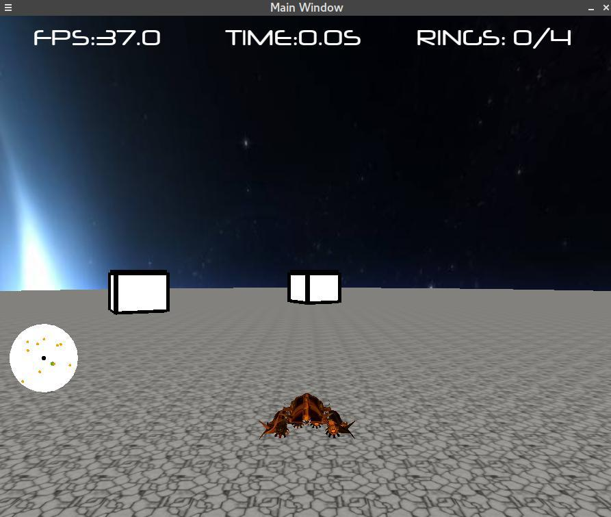
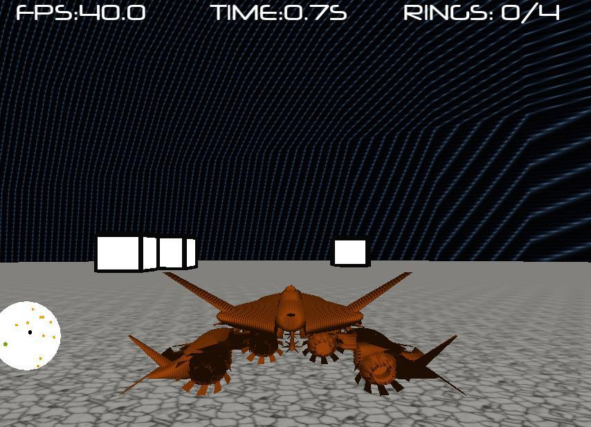
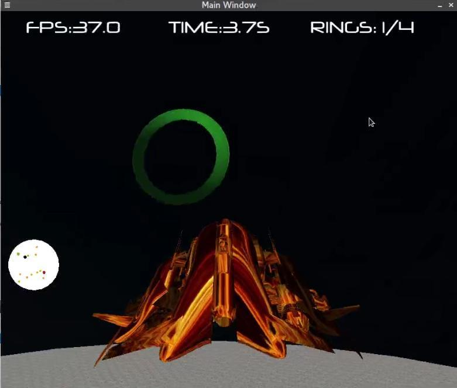
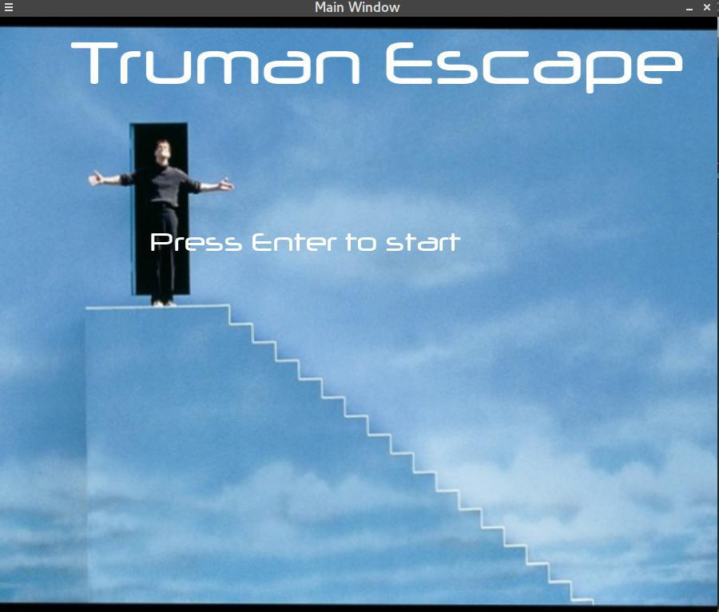
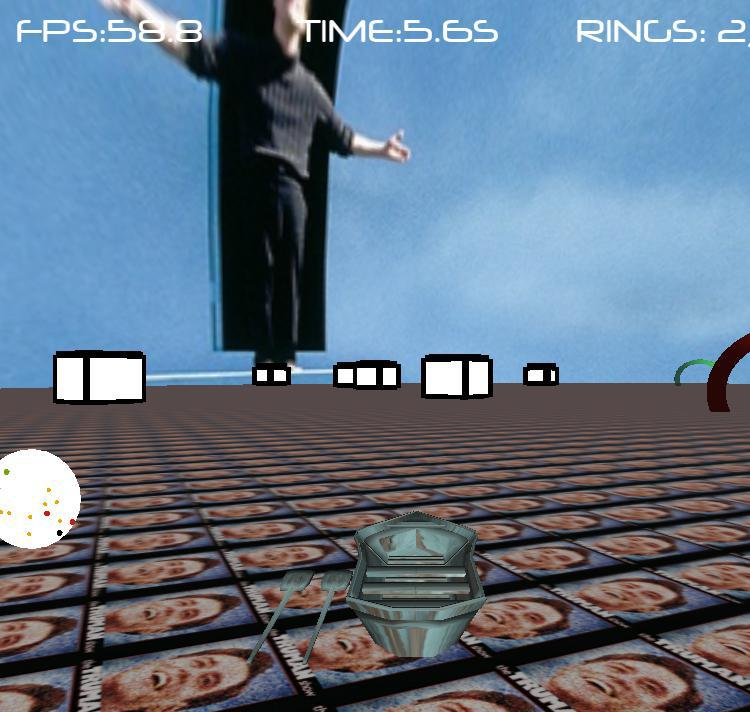
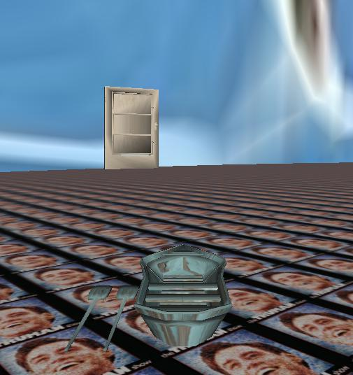

# Flappy Ship
Benvenuti nell'esaltante mondo di Flappy Ship, dove non c'è tempo di pensare ma soltanto di volare!
Tuffatevi in una corsa contro il tempo spaziale! Riuscirete ad attraversare tutti gli anelli prima che giunga la fine?

## Start
Per cominciare, bisogna avviare il gioco dando come argomento il nome del giocatore:
`./start_game <player name>`
Questo verrà usato per mantenere un ranking dei migliori giocatori di **Flappy Ship** nel tempo (si veda in seguito per i dettagli).

## Splash
Appena avviato, si presenta l'artistica schermata di Splash:

## Gameplay
Lo scopo del gioco è quello di attraversare tutti gli anelli del potere prima dello scadere del tempo. In cima allo schermo potremo leggere quanto tempo ci rimane prima del Game Over. Ogni volta che attraverseremo un anello acquisiremo un bonus di tempo che ci permetterà, se siamo fortunati, di raggiungere il prossimo anello.

Se riusciamo ad attraversare tutti gli anelli allora avremo vinto, e comparirà una schermata di vittoria; viceversa una di sconfitta.

## Game Over
Quando si raggiungono tutti gli anelli oppure il tempo scade si passa alla schermata di fine gioco.
Se si vince la schermata sarà verde:

altrimenti rossa:

#### Ranking
Il gioco mantiene un ranking aggiornato di tutti i giocatori che hanno preso parte al magico mondo di **Flappy Ship**. Quando si vince viene mantenuto il tempo totale impiegato dal giocatore ad attraversare tutti gli anelli e viene salvato nel file `ranking.txt`. Sulla schermata finale poi viene mostrato il ranking dei 5 migliori tempi.

### Anelli del Potere
Gli anelli del potere sono anelli verdi che dobbiamo cercare per il campo, rintracciabili tramite i pallini verdi sulla mappa. Vengono generati in coordinate random: la vicinanza o la lontananza l'uno dall'altro è solamente frutto del caso e *della nostra fortuna*.
Quando vengono attraversati gli anelli cambiano colore, diventando rossi (cambia anche il colore del pallino); ed un nuovo anello viene renderizzato e compare sulla mappa in verde.

### Cubi Malvagi
I cubi malvagi sono degli ostacoli che troviamo sparsi - anch'essi in maniera random - per tutto il campo di gioco. Quando vengono attraversati scatta una penalità.

##### Penalty
la navicella inizia a lampeggiare indicandoci che siamo stati rallentati per una manciata di secondi. Il lampeggiamento è ottenuto cambiando la modalità di rendering ogni 200millisecondi, alternando un rendering normale ad uno wireframe.

## HUD
Utilizzando font TrueType (si veda dettagli in seguito) viene disegnato a schermo un Head-Up display contenente le seguenti informazioni:
`FPS - Tempo rimanente - Anelli attraversati`

## Minimappa
In basso a sinitra è presente una mappa che indica con colori diversi i vari elementi del gioco e la posizione della navetta relativamente all'intero campo di gioco.
Quando gli anelli vengono attraversati i rispettivi puntini cambiano colore con essi, da verdi divengono rossi.

## Camera
Premendo `F1` si può cambiare la camera durante il gameplay, ci sono 5 modalità diverse:
**Retro - Dettagli - Grandangolo - Pilota - Arbitraria**

## Settings
Premendo `ESC` si può accedere in ogni momento di gioco al menù e modificare determinate opzioni. Per ogni opzione vi è indicato se è attiva o meno. Utilizzando le frecce di navigazione Su/Giù si può selezionare una determinata opzione che viene evidenziata in giallo. Una volta evidenziata, si può settare su On/Off con le frecce sinistra/destra.
Inoltre, quando il menù è attivato il timer si ferma così da poter mantenere il gioco in pausa.

##### Wireframe
Una volta attivato il render dell'intero ambiente - suolo escluso - viene fatto in wireframe, ovvero disegnando solamente i bordi degli oggetti.

##### Environment Mapping
Attiva l'environment mapping per avere superfici più realistiche, simulando la riflessione dell'ambiente circostante. Se invece lo si disattiva dal menù delle opzioni allora il mondo apparirà molto meno realistico:

## Opzioni Avanzate
#### Blending
Attiva le trasparenze (ON a default) di anelli e cubi malvagi.

#### Flappy Flight - HARD
Quando si attiva questa opzione il gioco ricomincia da capo in **modalità difficile**. Ci si ritrova nello stesso scenario ma questa volta tutto può fluttuare nell'aria, anche la nostra navetta spaziale. Premendo l'acceleratore 'W' la navetta impennerà e si librerà in aria; quando non si preme nulla si torna a terra attirati dalla gravità; quando infine si preme il freno 'S' la navetta accelererà verso il basso. Il muso della navetta si inclinerà seguendo la direzione del volo dando l'effetto tipico del celebre gioco per smartphone *Flappy Bird*.
Anche anelli e cubi saranno sparsi per il cielo, per cui sarà più difficile riuscire a vincere.

___
# EASTER EGG
Proprio quando pensavi di sapere tutto di questo frenetico gioco, scoprirai che c'è un *easter egg* nascosto che può essere attivato solamente in una maniera.
Se come nome del giocatore viene passata la stringa **` "Truman" `** allora il gioco si avvierà in una modalità speciale.

## Truman Escape
Questa volta lo Splash iniziale sarà diverso. Il nome ci anticipa già qual è la sorpresa. Il celebre Truman si ritrova di nuovo imprigionato dentro l'effimera finzione di un universo sferico e finito (l'universo del gioco è difatti una sfera...) e deve scappare.

La texture applicata al cielo mostra proprio una sua immagine vicina alla scala che porta alla libertà. Il pavimento è cosparso di volantini con la sua faccia.
La nostra navetta è stata scambiata con la barchetta che lui utilizza per scappare nel film, che in compenso ha acquisito la capacità di levitare!

## Porta Finale
Questa volta non ci basterà completare l'attraversamento di tutti gli anelli. Una volta attraversato l'ultimo, comparirà la porta segreta che non è segnata sulla minimappa. Il nostro compito è quello di raggiungerla e conquistare la libertà. Tutto questo - ovviamente - prima dello scadere inesorabile del tempo.

---

## Caratteristiche Tecniche
Per realizzare questa applicazioni sono stati utilizzati esclusivamente OpenGL per tutti gli elementi grafici e SDL per il supporto a eventi, periferiche e finestre.

### Dettagli Grafici:
* Visione prospettica degli elementi mediante una camera dinamicamente posizionata dietro alla nave, con distanze variabili a seconda del tipo di camera che si sceglie premendo `F1`;
* Supporto ad *Adaptive Vertical Synchronization (VSync)* ;
* Illuminazione tramite le luci di OpenGL, nello specifico l'ambiente è illuminato da GL\_LIGHT0;
* Supporto ai formati **OBJ** per il caricamento di Mesh, utilizzate per la navetta, la barca e la porta finale in modalità Truman Escape;
* Supporto a texture utilizzate per il pavimento, il cielo, la barca, la navetta spaziale e la porta finale;
* Supporto a font TrueType per la scrittura a schermo, tramite un atlas di textures pre-caricate;
* Possibilità di attivare environment mapping;
* Possibilità di attivare le trasparenze tramite alpha-blending;
* Espansioni: vi è anche la possibilità di disegnare ombre ed i fari dell'astronave ma ha qualche bug da correggere al momento.

### TrueType Font Rendering
L'unica maniera di utilizzare un font TrueType in OpenGL è di renderizzare ogni glifo come texture che rappresenta un bell'ostacolo per le prestazioni.
Per questo motivo, è stata scritta una piccola libreria che carica un atlas di chars del font TrueType scelto e lo salva come un vettore di textures direttamente sulla GPU. Questo pre-caricamento permette di renderizzare ogni lettera come una texture già in memoria, aggirando il problema delle prestazioni.
Per caricare i singoli glifi è stata utilizzato la libreria [SDL_ttf](https://www.libsdl.org/projects/SDL_ttf/docs/index.html).

### Software Design
Il progetto è consiste di ~4700 righe di codice di C++11. Per questo il codice è stato ampiamente commentato e si è cercato di tenerlo più modulare possibile, anche per favorire future espansioni. L'architettura è basata su callbacks asincrone. Si è cercato inoltre di utilizzare le nuove features di C++ disponibili dal 2011, come le novità aggiunte alla libreria standard (ad es. smart pointers) ed il supporto a lambda e closure.
